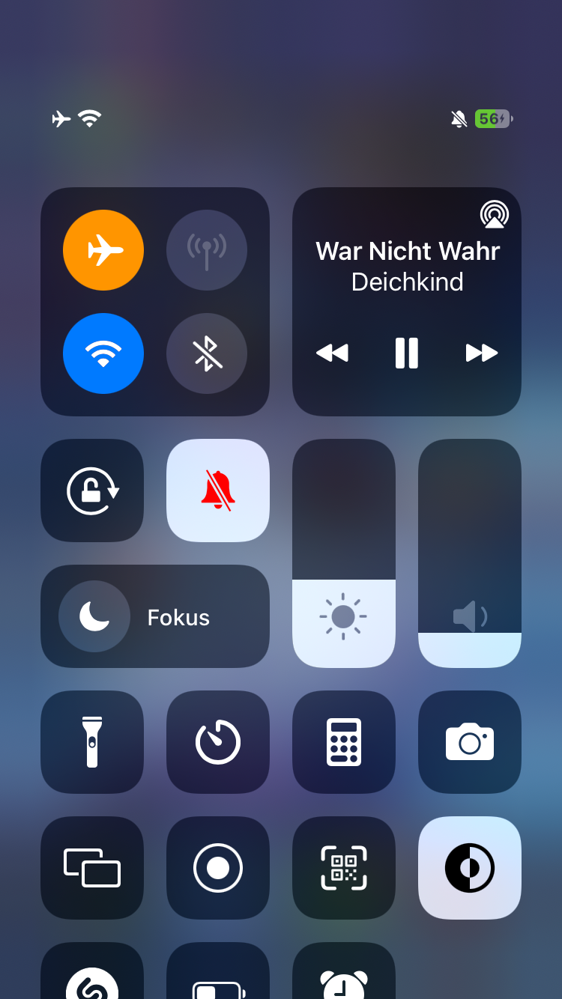
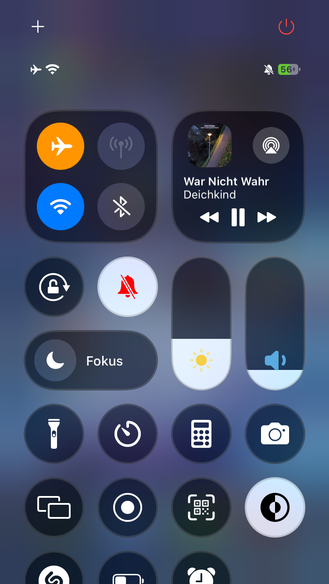

# CC26

An iOS 18-inspired Control Center tweak for jailbroken devices (iOS ~13–17). Removed liquid glass effects since more promising tweaks will come in the future. 
This tweak should give you a fresh and modern CC. 
Only tested on iOS 15, without any other modules than default. 

## Features

- **Rounded modules** — pill-shaped sliders, circular buttons, smooth continuous corners
- **Modern media module** — compact layout with album art, track info, and AirPlay button
- **Colored slider glyphs** — customizable brightness and volume icons
- **Top action buttons** — quick-access + (add) and power button with respring/UICache/userspace reboot
- **Fully configurable** — adjust colors, positions, and toggle features from Settings

## Screenshots

| Stock | CC26 |
| --- | --- |
|  |  |

## Compatibility

- iOS ~13 – 17.x
- Rootful & rootless jailbreaks

## Credits

- [dayanch96](https://github.com/dayanch96) — inspiration and original code
- [MTACS](https://github.com/MTACS) — support and help
